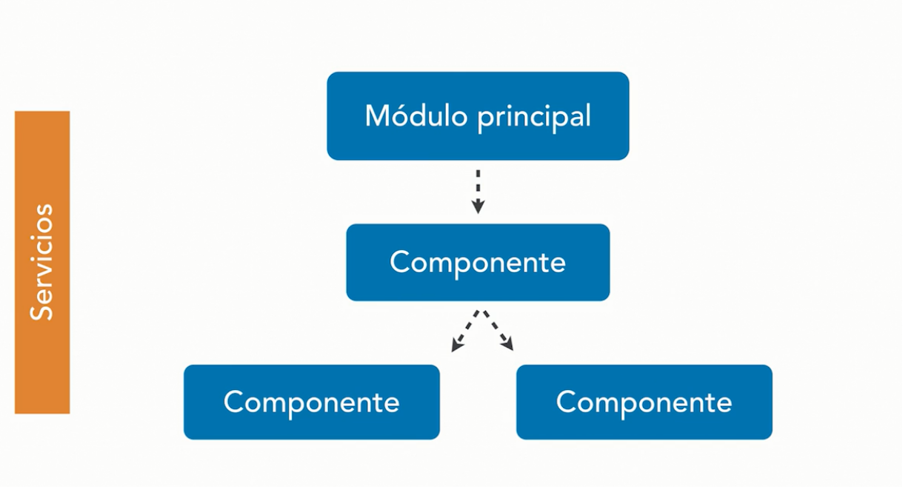
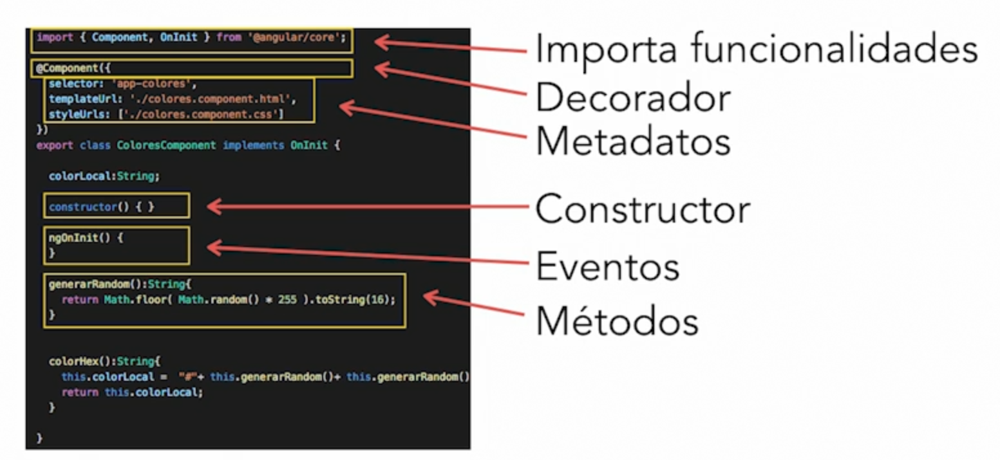
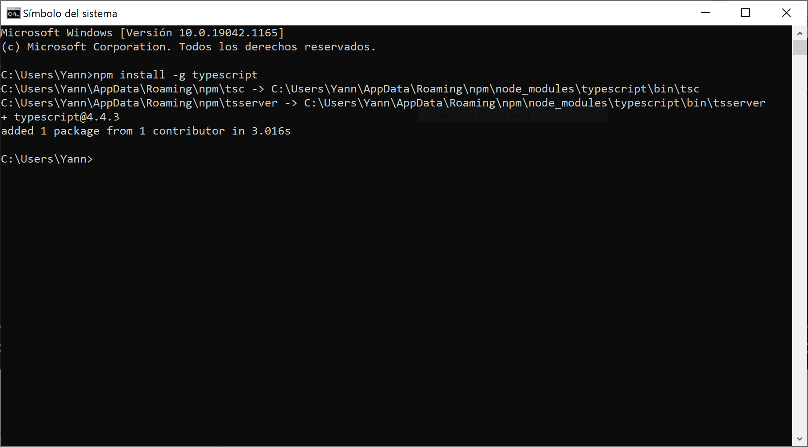

# Angular 11

  
  

## Contenido:

* [¿Qué es Angular?](#qué-es-angular)
* [Partes de una App en Angular](#partes-de-una-app-en-angular-más-comunes)
* [Instala NodeJS](#instala-node-js)
* [Instala TypeScript](#instala-typescript)
* 

## ¿Qué es Angular?

Hoy en día Angular es una plataforma que puede ejecutarse en: 

* Moviles
* Servidores 
* Navegadores

Está pensado con la filosofía MobileFirst, es decir busca adaptarse a todas las plataformas buscando un rendimiento impresionante. Un aspecto importante es que es una plataforma sostenida por Google y Microsoft.

Siempre estará basado en un módulo principal el cual nos permitirá acceder a diferentes partes de las aplicaciones.

* **Componente:** Es la unidad fundamental dentro de Angular, podemos tener componentes para desplegar información, acciones e incluso componentes embebidos que hacen cada vez más compleja la app.

Cada componente está pensado para estar encapsulado, es decir, si tenemos un componente anidado dentro de otro, no va a poder comunicarse con los componentes en los que está trabajando, así sea dentro de la misma pantalla. 

Para poder comunicar los componentes y toda la aplicación en general, vamos a trabajar con el concepto de servicios, que pueden transportar la información a lo largo de nuestras aplicaciones. 

Un componente tiene un tiempo de vida que va a depender de el tiempo de uso. En muchos casos, en la mayoría de ellos, el componente se va a encontrar funcional y en memoria mientras nosotros lo tengamos en pantalla. Si salimos de una ruta o dejamos de utilizar ese componente, el componente se destruye. 

El código fuente que se verá a lo largo de este proyecto va a ser un conjunto de archivos en TypeScript, CSS, JavaScript, HTML.

## Partes de una APP en Angular más comunes

* Módulos: Es el punto de entrada, toda app tiene almenos 1 modulo principal. Además permite agrupar las funcionalidades de la app.

* Componentes: Es un bloque central de la app, basicamente se trata de cualquier elemento interactivo, es el bloque fundamental de construcción por lo que pueden ir anidados. El bloque tiene un ciclo de vida dependiendo de la aplicación. Cuando dejemos de usarlo se elimina haciendo eficiente las aplicaciones de angular respecto a la memoria.

Los componentes pueden comunicarse entre sí con: `inputs, outputs` y `servicios`. Para poder darnos una idea podemos imaginar una página de wikipedia en función de componentes y como podrían llegar a presentarse:

Si le dieramos un vistazo general a la estructura del código de un componente podría verse de la siguiente manera:

* Plantillas: En resumen es HTML al cual se le puden inyectar datos, es la parte visual del componente.

* Servicios: Los servicios principalmente nos sirven para almacenar información y están activos mientras esté viva la aplicación. La unica manera de borrar la información de un servicio es cerrar la aplicación y despues abrirla.

Pueden comunicarse con cualquier componente de la aplicación:

Si le dieramos un vistazo rápido al código podriamos ver algo como lo siguiente:

* Directivas: Se trata de un componente sin plantilla. Existen 2 tipos de plantillas; las estructurales las cuales permiten agregar o eliminar elementos. Y las de atributo que pueden cambiar la apariencia o comportamiento de un elemento.

Si vieramos un ejemplo básico de código tendriamos lo siguiente:

Imagenes recopilaras de curso Angular 11 del grande [Carlos_Solís](https://www.linkedin.com/in/carlossolisdavila/?trk=lil_course) y basado en los ejercicios de [este](https://github.com/siddharta1337/Angular-4-Esencial) repositorio.

## Instala Node JS

Para el desarrollo de este proyecto se usará mucho **Node JS** para manejar todos los paquetes, si aún no se tiene instalado puede consultarse en su [Sitio oficial de NodeJS](https://nodejs.org/es/), aquí podrás encontrar toda la información al respecto del proceso de instalación en función de tu sistema operativo.

## Instala TypeScript

TypeScript es un super set de JavaScript, es decir, un JavaScript con herramientas adicionales que nos permitan crear programación más robusta. En este proyecto se usará `TypeScript` para construir aplicaciones en Angular. 

Para instalar TypeScript dirigete a su [sitio oficial](https://www.typescriptlang.org/) donde podrás encontrar más información con respecto a la instalación.

O bien hacerlo mediante NodeJS (Previamente instalado) e instalar TypeScript mediante NPM que es el gestor de paquetes. Abrir la terminal y ejecutar el siguiente comando: `npm install -g typescript`. Donde `-g` le indica que instale typescript de forma global, permitiendo tener accesible toda su funcionalidad en cualquier parte del sistema.

Para comprobar que se instaló correctamente se puede ejecutar el comando `tsc -v`, al ejecutarse nos mostrará la versión de TypeScript instalada. (Se recomienda reiniciar la computadora en caso de que aún no se vea reflejada la versión).

## Manejo desde el terminal con Angular CLI

Para poder usar la terminal de Angular debemos ejecutar el siguiente comando desde la terminal de nuestro Visual Studio Code `npm install -g @angular/cli`, al dar enter, instalará de forma global la consola de angular debido a la bandera `-g`.

Una vez que se haya instalado en la computadora podremos usar los comandos de Angular. Por ejemplo el comando `ng version` que nos devuelve la versión de nuestro Angular instalado previamente.

## Creando una aplicación desde cero

Para crear una aplicación desde cero podemos ejecutar el siguiente comando `ng new nombreAplicacion` al ejecutarlo nos hará una serie de preguntas por ejemplo:
* ¿Quieres que verifique de forma estricta?: Se suguiere ponerle **Sí**
* ¿Quieres que exista enrutado?: Esto nos permite que exista navegación dentro de una aplicación Angular, para efectos del proyecto le indicarémos que **No**.
* ¿Qué tipo de CSS desea utilizar?: Para efectos del proyecto podemos seleccionar la opción de **SCSS**.

Y listo, con esto dejaremos que cargue el comando y nos genere los archivos necesarios para nuestra aplicación.

## Crear un elemento

Para ello podemos ejecutar el comando `ng generate` que nos permitirá crear cualquier elemento de Angular. Por ejemplo `ng generate component nombreComponente`.

Si al ejecutar te sale un error como el siguiente tranquilo/a, lo marca porque no estamos posicionados en la carpeta del proyecto

Para solucionarlo simplemente podemos usar el comando `cd` que permite cambiar de directorio, por ejemplo: `cd nombreDirectorio`.
Y ahora si ejecuta el comando anterior:

Podemos verificarlo al ver nuestros archivos de la carpeta:

